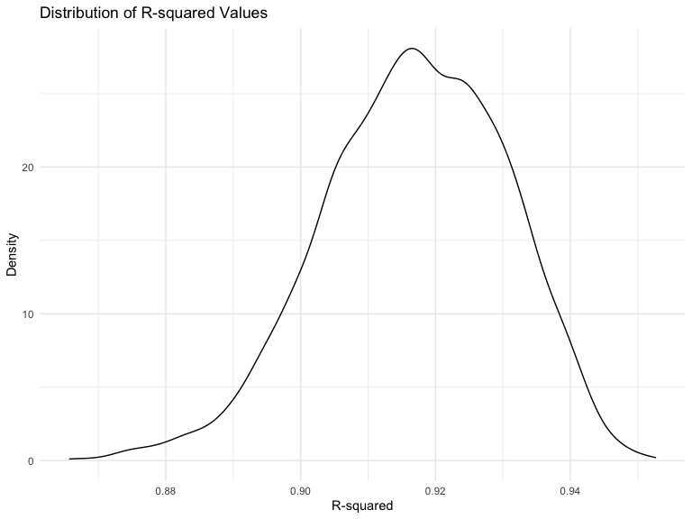
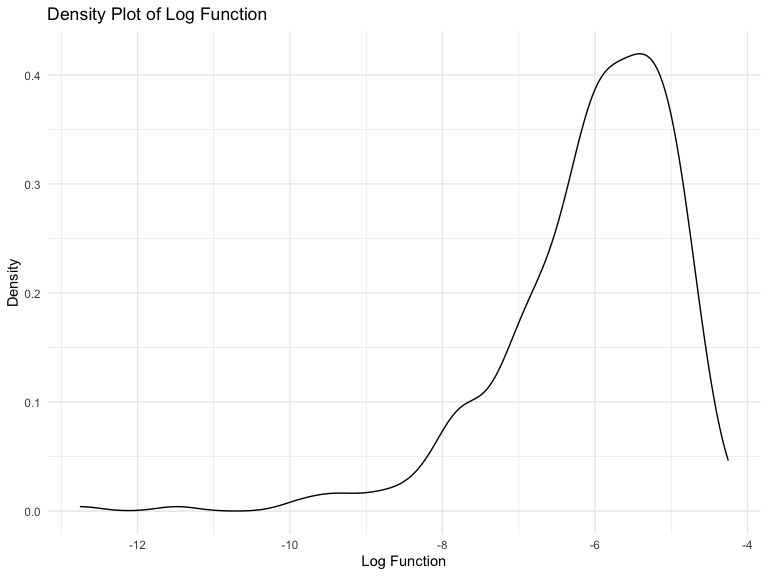
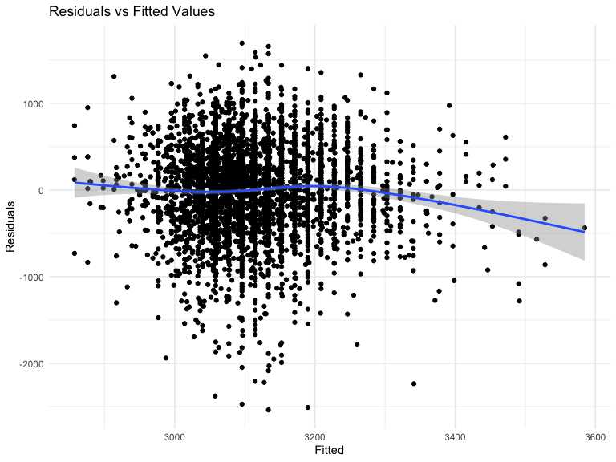
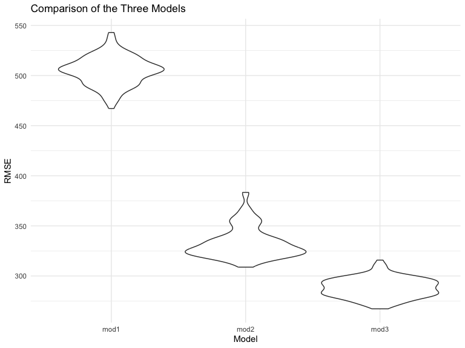

Homework 6
================
Shina Min

### Due date

Due: December 3 at 11:59pm.

### Points

| Problem   | Points |
|:----------|:-------|
| Problem 0 | 20     |
| Problem 1 | –      |
| Problem 2 | 40     |
| Problem 3 | 40     |

### Problem 0

This “problem” focuses on structure of your assignment, including the
use of R Markdown to write reproducible reports, the use of R Projects
to organize your work, the use of relative paths to load data, and the
naming structure for your files.

To that end:

- create a public GitHub repo + local R Project for this assignment
- write solutions using a .Rmd file that outputs a `github_document` /
  .md file
- submit a link to your repo via Courseworks

Your solutions to Problems 1 and 2 should be implemented in your .Rmd
file, and your git commit history should reflect the process you used to
solve these Problems.

For Problem 0, we will assess adherence to the instructions above
regarding repo structure, git commit history, and whether we are able to
knit your .Rmd to ensure that your work is reproducible. Adherence to
appropriate styling and clarity of code will be assessed in Problems 1+
using the homework [style rubric](homework_style_rubric.html).

This homework includes figures; the readability of your embedded plots
(e.g. font sizes, axis labels, titles) will be assessed in Problems 1+.

``` r
library(tidyverse)
library(modelr)
```

### Problem 1

In the data cleaning code below we create a `city_state` variable,
change `victim_age` to numeric, modifiy victim_race to have categories
white and non-white, with white as the reference category, and create a
`resolution` variable indicating whether the homicide is solved. Lastly,
we filtered out the following cities: Tulsa, AL; Dallas, TX; Phoenix,
AZ; and Kansas City, MO; and we retained only the variables
`city_state`, `resolution`, `victim_age`, `victim_sex`, and
`victim_race`.

``` r
homicide_df = 
  read_csv("data/homicide-data.csv", na = c("", "NA", "Unknown")) |> 
  mutate(
    city_state = str_c(city, state, sep = ", "),
    victim_age = as.numeric(victim_age),
    resolution = case_when(
      disposition == "Closed without arrest" ~ 0,
      disposition == "Open/No arrest"        ~ 0,
      disposition == "Closed by arrest"      ~ 1)
  ) |> 
  filter(victim_race %in% c("White", "Black")) |> 
  filter(!(city_state %in% c("Tulsa, AL", "Dallas, TX", "Phoenix, AZ", "Kansas City, MO"))) |> 
  select(city_state, resolution, victim_age, victim_sex, victim_race)
```

    ## Rows: 52179 Columns: 12
    ## ── Column specification ────────────────────────────────────────────────────────
    ## Delimiter: ","
    ## chr (8): uid, victim_last, victim_first, victim_race, victim_sex, city, stat...
    ## dbl (4): reported_date, victim_age, lat, lon
    ## 
    ## ℹ Use `spec()` to retrieve the full column specification for this data.
    ## ℹ Specify the column types or set `show_col_types = FALSE` to quiet this message.

Next we fit a logistic regression model using only data from Baltimore,
MD. We model `resolved` as the outcome and `victim_age`, `victim_sex`,
and `victim_race` as predictors. We save the output as `baltimore_glm`
so that we can apply `broom::tidy` to this object and obtain the
estimate and confidence interval of the adjusted odds ratio for solving
homicides comparing non-white victims to white victims.

``` r
baltimore_glm = 
  filter(homicide_df, city_state == "Baltimore, MD") |> 
  glm(resolution ~ victim_age + victim_sex + victim_race, family = binomial(), data = _)

baltimore_glm |> 
  broom::tidy() |> 
  mutate(
    OR = exp(estimate), 
    OR_CI_upper = exp(estimate + 1.96 * std.error),
    OR_CI_lower = exp(estimate - 1.96 * std.error)) |> 
  filter(term == "victim_sexMale") |> 
  select(OR, OR_CI_lower, OR_CI_upper) |>
  knitr::kable(digits = 3)
```

|    OR | OR_CI_lower | OR_CI_upper |
|------:|------------:|------------:|
| 0.426 |       0.325 |       0.558 |

Below, by incorporating `nest()`, `map()`, and `unnest()` into the
preceding Baltimore-specific code, we fit a model for each of the
cities, and extract the adjusted odds ratio (and CI) for solving
homicides comparing non-white victims to white victims. We show the
first 5 rows of the resulting dataframe of model results.

``` r
model_results = 
  homicide_df |> 
  nest(data = -city_state) |> 
  mutate(
    models = map(data, \(df) glm(resolution ~ victim_age + victim_sex + victim_race, 
                             family = binomial(), data = df)),
    tidy_models = map(models, broom::tidy)) |> 
  select(-models, -data) |> 
  unnest(cols = tidy_models) |> 
  mutate(
    OR = exp(estimate), 
    OR_CI_upper = exp(estimate + 1.96 * std.error),
    OR_CI_lower = exp(estimate - 1.96 * std.error)) |> 
  filter(term == "victim_sexMale") |> 
  select(city_state, OR, OR_CI_lower, OR_CI_upper)

model_results |>
  slice(1:5) |> 
  knitr::kable(digits = 3)
```

| city_state      |    OR | OR_CI_lower | OR_CI_upper |
|:----------------|------:|------------:|------------:|
| Albuquerque, NM | 1.767 |       0.831 |       3.761 |
| Atlanta, GA     | 1.000 |       0.684 |       1.463 |
| Baltimore, MD   | 0.426 |       0.325 |       0.558 |
| Baton Rouge, LA | 0.381 |       0.209 |       0.695 |
| Birmingham, AL  | 0.870 |       0.574 |       1.318 |

Below we generate a plot of the estimated ORs and CIs for each city,
ordered by magnitude of the OR from smallest to largest. From this plot
we see that most cities have odds ratios that are smaller than 1,
suggesting that crimes with male victims have smaller odds of resolution
compared to crimes with female victims after adjusting for victim age
and race. This disparity is strongest in New yrok. In roughly half of
these cities, confidence intervals are narrow and do not contain 1,
suggesting a significant difference in resolution rates by sex after
adjustment for victim age and race.

``` r
model_results |> 
  mutate(city_state = fct_reorder(city_state, OR)) |> 
  ggplot(aes(x = city_state, y = OR)) + 
  geom_point() + 
  geom_errorbar(aes(ymin = OR_CI_lower, ymax = OR_CI_upper)) + 
  theme(axis.text.x = element_text(angle = 90, hjust = 1))
```


## Problem 2

``` r
weather_df = 
  rnoaa::meteo_pull_monitors(
    c("USW00094728"),
    var = c("PRCP", "TMIN", "TMAX"), 
    date_min = "2022-01-01",
    date_max = "2022-12-31") |>
  mutate(
    name = recode(id, USW00094728 = "CentralPark_NY"),
    tmin = tmin / 10,
    tmax = tmax / 10) |>
  select(name, id, everything())
```

    ## using cached file: /Users/shinamin0218/Library/Caches/org.R-project.R/R/rnoaa/noaa_ghcnd/USW00094728.dly

    ## date created (size, mb): 2023-10-03 10:19:25.871292 (8.525)

    ## file min/max dates: 1869-01-01 / 2023-09-30

## Fitting a regression model.

``` r
fit =
  lm(tmax ~ tmin + prcp, data = weather_df) %>%
  broom::tidy() %>% 
  knitr::kable(digits = 3)
```

## Creating function for bootstrap.

``` r
boot_sample = function(weather_df) {
  sample_frac(weather_df, replace = TRUE)
}
```

## Producing estimates of these two quantities.

``` r
r_squared =
  weather_df %>%
  modelr::bootstrap(n = 5000) %>%
  mutate(
    models = map(strap, ~lm(tmax ~ tmin + prcp, data = .x)),
    results = map(models, broom::glance)
  ) %>%
  unnest(results)
```

## Plotting the distribution of the estimates.

``` r
r_squared_plot =
  ggplot(r_squared, aes(x = r.squared)) +
  geom_density() +
  labs(
    title = "Distribution of R-squared Values",
    x = "R-squared",
    y = "Density"
  ) +
  theme_minimal()

print(r_squared_plot)
```


\* These density plots visually represent the distribution of the
bootstrap estimates for `r_squared` and `log(beta_1 * beta_2)`. The plot
for `r_squared` shows a distribution that is very close to normal, with
a slight left-skewness. The values span a range from approximately 0.888
to 0.941.

## Identifying the 2.5% and 97.5% quantiles to provide a 95% confidencePerforming a 95% confidence interval for r̂ 2 and log(β̂ 0∗β̂.1)

``` r
r_squared %>%
  summarize(
    lower_limit = quantile(r.squared, 0.025), 
    upper_limit = quantile(r.squared, 0.975)) %>% 
  knitr::kable(digits = 3)
```

| lower_limit | upper_limit |
|------------:|------------:|
|       0.889 |       0.941 |

- The 95% confidence interval for R^2 is (0.888, 0.941)

## Creating estimate for log(beta_0 \* beta_1)

``` r
log_estimate =
  weather_df %>%
  modelr::bootstrap(n=1000) %>%
  mutate(
    models = map(strap, ~lm(tmax ~ tmin + prcp, data = .x)),
    results = map(models, broom::tidy)) %>%
  select(-strap, -models) %>%
  unnest(results) %>%
  select(.id, term, estimate) %>%
  pivot_wider(
    names_from = "term",
    values_from = "estimate") %>%
  mutate(
    log_function = log(prcp * tmin))

log_plot = log_estimate %>%
  ggplot(aes(x = log_function)) +
  geom_density() +
  labs(
    x = "Log Function",
    y = "Density",
    title = "Density Plot of Log Function"
  )

print(log_plot)
```



- In contrast, the plot for `log(beta_1 * beta_2)` shows a distinct
  left-skewness. The values span a range from approximately -8.007 to
  -4.615.

## Identifying a 95% CI for log(beta_0 \* beta_1)

``` r
log_estimate %>%
  drop_na() %>% 
  summarize(
    lower_limit = quantile(log_function, 0.025),
    upper_limit = quantile(log_function, 0.975)) %>%
  knitr::kable(digits = 3)
```

| lower_limit | upper_limit |
|------------:|------------:|
|      -8.779 |       -4.64 |

- The 95% confidence interval for log(beta_0 \* beta_1) lies between
  (-8.779 and -4.64)

## Problem 3

## Loading all the necessary packages

## Loading and cleaning the data for regression analysis.

``` r
birthweight_data = 
  read_csv("birthweight.csv") %>%  
  janitor::clean_names() %>%
  mutate(
    babysex = as.factor(babysex),
    frace = as.factor(frace),
    malform = as.factor(malform),
    mrace = as.factor(mrace)
  )
```

    ## Rows: 4342 Columns: 20
    ## ── Column specification ────────────────────────────────────────────────────────
    ## Delimiter: ","
    ## dbl (20): babysex, bhead, blength, bwt, delwt, fincome, frace, gaweeks, malf...
    ## 
    ## ℹ Use `spec()` to retrieve the full column specification for this data.
    ## ℹ Specify the column types or set `show_col_types = FALSE` to quiet this message.

## Proposing a regression model for birthweight.

``` r
fit_birthweight = lm(bwt ~ smoken + pnumlbw + momage, data = birthweight_data)
fit_birthweight %>%  broom::tidy()
```

    ## # A tibble: 4 × 5
    ##   term        estimate std.error statistic   p.value
    ##   <chr>          <dbl>     <dbl>     <dbl>     <dbl>
    ## 1 (Intercept)  2758.       40.9      67.4   0       
    ## 2 smoken         -5.97      1.04     -5.75  9.68e- 9
    ## 3 pnumlbw        NA        NA        NA    NA       
    ## 4 momage         18.8       1.98      9.47  4.50e-21

## Showing a plot of model residuals against fitted values – use add_predictions and add_residuals in making this plot:

``` r
# Adding residuals and predictions to birthweight_data
residuals_predictions_data =
  birthweight_data %>%  
  modelr::add_residuals(fit_birthweight) %>%
  modelr::add_predictions(fit_birthweight)

# Creating a scatter plot of residuals against fitted values
ggplot(residuals_predictions_data, aes(x = pred, y = resid)) + 
  geom_point() +
  labs(
    title = "Residuals vs Fitted Values",
    x = "Fitted",
    y = "Residuals"
  )
```



## Comparing your model to two others:

``` r
fit_birthweight2 = lm(bwt ~ + blength + gaweeks, data = birthweight_data)
fit_birthweight3 = lm(bwt ~ bhead + bhead * blength * babysex, data = birthweight_data)
```

- These lines of code are fitting two different linear regression models
  to the `birthweight_data` dataset. The first model `fit_birthweight2`
  considers birth length and gestational age as main effects, while the
  second model `fit_birthweight3` includes head circumference, birth
  length, sex, and all interactions between them, up to the three-way
  interaction

## Making this comparison in terms of the cross-validated prediction error; use crossv_mc and functions in purrr as appropriate:

``` r
cv_df = 
  crossv_mc(birthweight_data, 100) %>%
  mutate(
    train = map(train, as_tibble),
    test = map(test, as_tibble)
  )
```

## Comparing the model to two others:

``` r
cv_df = 
  cv_df %>%  
  mutate(
   mod_1 = map(.x = train, ~lm(bwt ~ smoken + pnumlbw + momage, data = .x)),
   mod_2 = map(.x = train, ~lm(bwt ~ + blength + gaweeks, data = .x)),
   mod_3 = map(.x = train, ~lm(bwt ~ bhead + bhead * blength * babysex, data = .x))
  ) %>%  
  mutate(
    rmse_mod1 = map2_dbl(mod_1, .y = test, ~rmse(model = .x, data = .y)),
    rmse_mod2 = map2_dbl(mod_2, .y = test, ~rmse(model = .x, data = .y)),
    rmse_mod3 = map2_dbl(mod_3, .y = test, ~rmse(model = .x, data = .y))
  )
```

# Creating a violin plot using the x-axis represents the different models, the y-axis represents the RMSE values, and showing the distribution of the RMSE for each model.

``` r
cv_df %>% 
  select(starts_with("rmse")) %>%
  pivot_longer(
    everything(),
    names_to = "model", 
    values_to = "rmse",
    names_prefix = "rmse_") %>% 
  mutate(model = fct_inorder(model)) %>% 
  ggplot(aes(x = model, y = rmse)) + geom_violin() +
  labs(
    x = "Model",
    y = "RMSE",
    title = "Comparison of the Three Models"
    ) 
```



- The suggested model, which incorporates all available predictors,
  demonstrated the lowest Root Mean Squared Error (RMSE), indicating the
  most precise predictions on the test data. Conversely, the main effect
  model, featuring only birth length and gestational age as predictors,
  resulted in less accurate predictions. The interaction model,
  encompassing all interactions along with the three-way interaction,
  exhibited a moderately higher RMSE, suggesting decreased accuracy
  compared to the comprehensive predictor set.

- In summary, lower RMSE values are indicative of superior predictive
  performance. Nevertheless, it is imperative to contextualize these
  results within the specific analytical context and modeling
  objectives.
